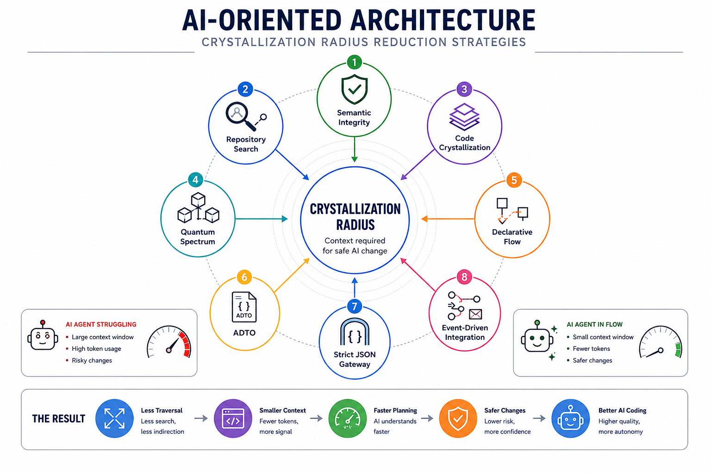

### AI Oriented Architecture — A New Optimization Target for Intelligent Systems

Status: Foundational Principle.

Spec Kit: [undef16/spec-kit-aioa](https://github.com/undef16/spec-kit-aioa)

A practical Spec Kit adaptation for applying AI Oriented Architecture principles in spec-driven development workflows.

### Context

For decades, software architecture has been optimized for humans.

We optimized for:

* readability;
* maintainability;
* extensibility;
* team scalability;
* operational reliability.

This was rational.

Humans were the primary consumers, maintainers, and modifiers of software systems.

That assumption is changing.

Modern software is increasingly modified by AI coding agents.

These agents do not experience software the way humans do.

They do not build long-term mental models.

They do not understand organizational context.

They do not navigate systems through intuition.

They consume context windows.

As a result, many architectural patterns that are effective for humans become expensive for autonomous agents.

The problem is not intelligence.

The problem is traversal.

### The Core Observation

When an AI agent performs a task, most of its effort is not spent generating code.

It is spent discovering context.

The agent must determine:

* where the relevant logic lives;
* which dependencies matter;
* which components are affected;
* which state transitions occurred;
* which contracts are valid;
* which side effects exist.

The larger this discovery process becomes, the larger the context window grows.

Cost increases.

Latency increases.

Error rates increase.

Reasoning quality decreases.

### The Crystallization Radius

We define a new architectural metric:

**Crystallization Radius**

Crystallization Radius is the amount of system context an AI agent must traverse before it can safely understand, modify, test, or verify a component.

Large Crystallization Radius means:

* broad repository searches;
* multi-service dependency tracking;
* excessive abstraction traversal;
* context-window inflation;
* expensive debugging cycles.

Small Crystallization Radius means:

* localized reasoning;
* isolated modifications;
* deterministic testing;
* predictable retrieval;
* lower token consumption.

### The Goal

The primary objective of AI Oriented Architecture is:

Minimize Crystallization Radius.

Every architectural decision should be evaluated through a simple question:

How much additional context must an AI agent consume before making a safe change?

If the answer expands the Crystallization Radius, the decision carries an operational cost.

### Applicability

AI Oriented Architecture is independent of deployment topology.

The framework applies equally to:

- modular applications;
- distributed systems;
- microservice architectures;
- event-driven platforms;
- hybrid enterprise environments.

### Two Fundamental Constraints

AI Oriented Architecture minimizes Crystallization Radius.

Semantic Integrity preserves Domain Meaning.

A system succeeds only when both are maintained.

Reducing Crystallization Radius without preserving Semantic Integrity leads to Semantic Collision.

Preserving Semantic Integrity without controlling Crystallization Radius leads to context explosion.

Both constraints must evolve together.

### Architectural Independence

AI Oriented Architecture is orthogonal to deployment architecture.

Whether the system runs as a modular application, a microservice platform, or a distributed environment is secondary.

The primary concern is minimizing Crystallization Radius while preserving Semantic Integrity.

A poorly structured microservice ecosystem may exhibit a larger Crystallization Radius than a well-designed modular application.

Likewise, a distributed platform can remain highly crystallized when boundaries, contracts, and reasoning paths stay local and explicit.

Crystallization evaluates how software is understood and modified.

It does not prescribe where software is deployed.

### Design Principles

AI Oriented Architecture favors:

* Local Reasoning
* Explicit Boundaries
* Context Isolation
* Atomic Components
* Deterministic Contracts
* Observable State Transitions
* Minimal Traversal Requirements

It disfavors:

* Hidden dependencies
* Deep abstraction chains
* Architectural glue layers
* Context scattering
* Runtime ambiguity
* Excessive orchestration

### The AI Oriented Architecture Framework

The following patterns exist to reduce Crystallization Radius at different layers of the system:

[**TIP-002**](./TIP-002.md)
Semantic Collision - The Erasure of Domain Boundaries.

Reduces: Semantic Crystallization Radius

[**TIP-003**](./TIP-003.md)
Repository Search Optimization

Reduce repository traversal and planning costs.

[**TIP-004**](./TIP-004.md)
Code Crystallization

Reduce architectural entropy and maximize atomicity.

[**TIP-005**](./TIP-005.md)
The Quantum Spectrum

Define Micro, Nano, and Pico decomposition boundaries.

[**TIP-006**](./TIP-006.md)
Declarative Straight-Line Code

Reduce control-flow traversal and nesting complexity.

[**TIP-007**](./TIP-007.md)
Strict JSON Gateways and Auditable DTOs

Move uncertainty to system boundaries and make runtime state explainable.

[**TIP-008**](./TIP-008.md)
Event-Driven Integration

Reduce cross-service reasoning dependencies.

### Why It Matters

Historically, software architecture optimized for human cognition.

Increasingly, software architecture must optimize for machine cognition as well.

The winning systems of the agentic era will not necessarily be those with the largest models.

They will be the systems with the smallest Crystallization Radius.

### Recommendations

For AI engineering teams:

* Treat Crystallization Radius as a first-class architectural concern.
* Prefer local reasoning over global understanding.
* Design systems that can be safely modified in isolation.
* Reduce the amount of context required for every engineering task.
* Measure architectural success by how little of the system must be understood before a safe change can be made.

The next generation of software architecture will not be defined by how much abstraction it can accumulate.

It will be defined by how little context an intelligent agent must traverse to create value.

#AI #LLM #AIAgents #SoftwareArchitecture #SystemDesign #AgenticAI #SoftwareEngineering #CodeQuality #TechLeadership #AIEngineering #Architecture

